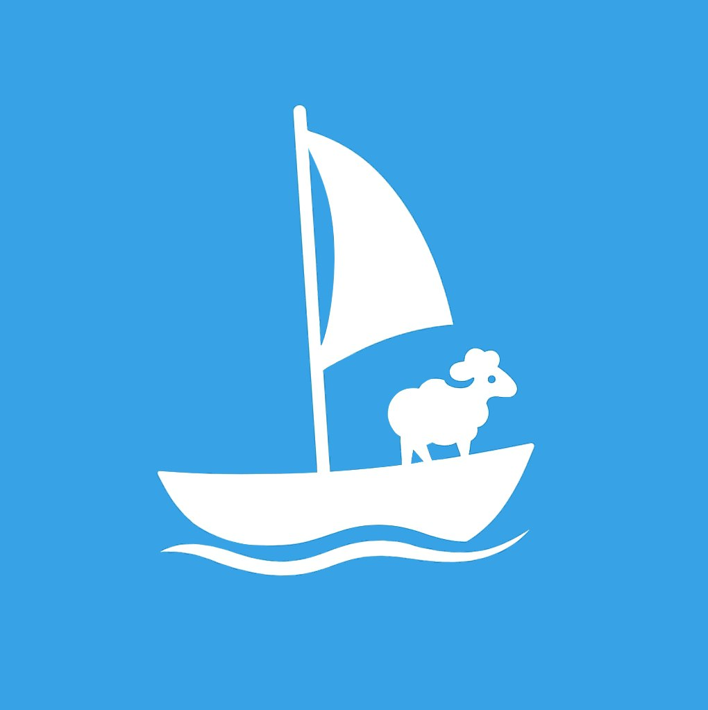

# FriendSheep

<div align="center">
  
</div>

**Команда:** NecroDwarf  
**Тип проекта:** Дипломная работа  
**Сфера:** Организация и проведение онлайн/офлайн мероприятий  
**Дизайн:** [Figma](https://www.figma.com/design/8KAL0DWM5TzdIcL45NiOgs/FriendShip?node-id=0-1&t=ZhU9IIhvY80N8Mw9-1)

---

## Описание

**FriendSheep** — это мультиплатформенное приложение (веб, мобильное, Telegram-бот), которое помогает людям организовывать встречи, кино- и игро-вечера с друзьями, не теряя важные детали и напоминания.

Проект реализован с использованием монолитной архитектуры, Docker для контейнеризации и оркестрации.

---

## Цели проекта

- Упростить планирование совместного досуга
- Объединить друзей через цифровые инструменты
- Повысить вовлеченность пользователей в социальные активности

---

## Технологии

### Backend:

- Go (Golang)
- REST API + Swagger (через swaggo)
- PostgreSQL
- Redis
- Docker + Docker Compose

### Frontend:

- Web: React.js
- Mobile: React Native
- Telegram Bot: Go + Telegram API

---

## Архитектура проекта

```plaintext
project-root/
├── backend/
│   ├── first-service/
│   ├── second-service/
│   ├── third-service/
│   └── ...
├── frontend/
│   ├── app/       # мобильное приложение
│   └── website/   # веб-интерфейс
├── kafka/         # конфигурация брокера и топиков
├── docker/        # docker-compose, Dockerfile, Helm/manifest
├── docs/          # Swagger, Whitepaper и прочая документация
└── README.md
```

## Функциональность

- Создание и управление мероприятиями

- Работа с группами друзей

- Уведомления через Telegram-бота

- Интеграция с Кинопоиск (рейтинги, описание контента)

- Поддержка онлайн и офлайн форматов

- Глобальные и групповые события

---

## 📈 Планы развития

1. MVP: веб-приложение + Telegram-бот + Мобильные приложения (iOS/Android)

2. Расширение: AI-рекомендации, аналитика, интеграции

3. Масштабирование и локализация

---

## 👨‍🎓 О дипломе

Проект **FriendSheep** является частью дипломной работы команды **NecroDwarf**. Он демонстрирует реальные навыки командной разработки, проектирования архитектуры, работы с современными технологиями и пользовательским интерфейсом.

<div align="center">
  
</div>
